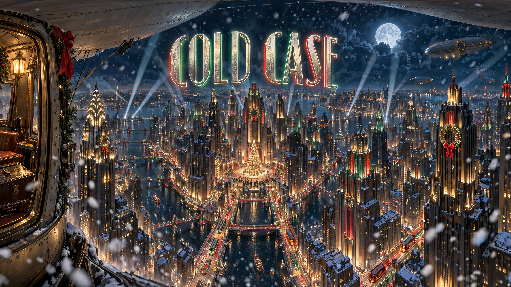

# Cold Case



**Play it:** https://nergalactic.github.io/christmas-caper/

A panorama noir mystery for the 2026 tacky website contest (theme: Reindeer Squad).

It's Christmas Eve at the North Pole, and lounge-singing snowman Jimmy Mittens has been found as a puddle in the alley behind the Mistletoe Lounge. His mother, Granny Slush, hires the only private eye who'll take the case: Tiny Hightower, an extremely short elf detective. The killer is obvious from the very first scene. Her hooves are on fire. Tiny will need three chapters, the entire Reindeer Squad, and several boosts onto high shelves to figure it out.

## How to play

- Drag to look around. The camera sits at Tiny's eye level, near the floor.
- Tap a marker to look at something, question someone, or move on. There is only ever one way forward, though Tiny never realizes it.
- Once Tiny finds his tinsel goggles, toggle them to reveal hidden clues.
- Some clues are too high to reach. Tiny will ask someone for a boost.
- The pause menu has sound, subtitles, and start over.

The game is an intro and three chapters across 13 scenes, with 259 fully voiced lines.

## Running it locally

No build step. Serve the folder and open it in a browser:

```
npm run serve
```

Then visit http://localhost:8080. Opening `index.html` directly from disk won't work, since browsers block its files outside a server. `editor.html` is the hotspot placement tool.

## Project layout

| Path | What's there |
|---|---|
| `index.html`, `src/` | The game: viewer, linear story engine (`src/game.js`), audio, sparkles, tutorial |
| `content/*.json` | Scenes, hotspots, and every line of dialogue, one file per chapter. Format in [content/README.md](content/README.md) |
| `content/panoramas/` | The 360° panoramas, one per scene plus the title card |
| `content/audio/` | Music (title and credits theme, Jimmy's song, Santa's theme) and `narration/`, the voiced lines |
| `promo/` | Cover art (PNG master and web JPG) |
| `art-masters/` | Unedited originals of retouched panoramas |
| `art-prompts.md` | The prompts used to generate every panorama |
| `music/` | Jimmy's song lyrics and style prompts |
| `narration-script/` | Voice design notes and the recording sheet |
| `DESIGN.md` | Story, cast, chapter breakdown, and design pillars |

## Checking content

```
npm run check
```

Validates every scene, hotspot, and beat reference, then simulates a playthrough from the office to the ending.

## Voice workflow

Lines are recorded by hand in ElevenLabs, one mp3 per line, named `<beatId>_<lineNumber>.mp3`.

```
npm run narration:sheet     # full recording sheet, with recorded lines checked off
npm run narration:todo      # only the lines still missing audio
npm run narration:manifest  # rebuild content/audio/narration/manifest.json after adding files
```

Any line without audio falls back to a timed subtitle, so the game always plays through.

## Dev hooks (browser console)

- `__goto("alley")` jumps to a scene
- `__look(45, 25)` points the camera at a yaw/pitch
- `__setFlag("revealed")` sets a story flag
- `__showCredits()` previews the credits. Click the page once first, since browsers block audio started from the console until you've interacted with the page.

## Made with

- Panoramas and cover art: AI-generated with Panopulse
- Voices and music: AI-generated with ElevenLabs
- Panorama viewer, audio, narration, tutorial, editor, and voice pipeline: adapted from The Mystery of Skua Island's panorama build. The story engine is new.
- Three.js, vendored under its MIT license

## License

Copyright (c) 2026 Nergalactic. All rights reserved.

Nergalactic owns all images, sounds, voiceovers, music, and code in this game, along with its story and characters. The game is public to play and view, but no part of it may be copied, modified, distributed, or reused without permission. See [LICENSE](LICENSE).

The only exception is Three.js, which is third-party software under its own MIT license ([vendor/three/LICENSE](vendor/three/LICENSE)).
